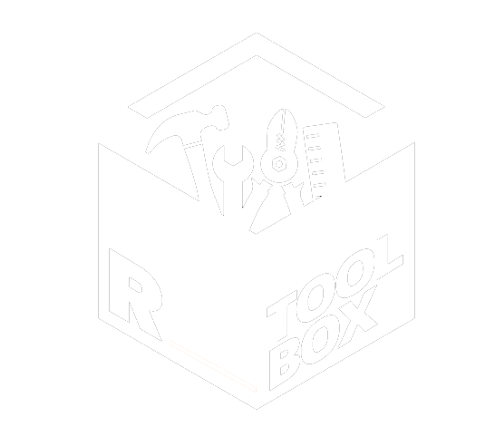
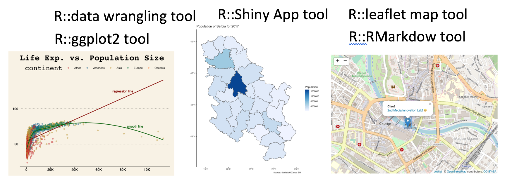
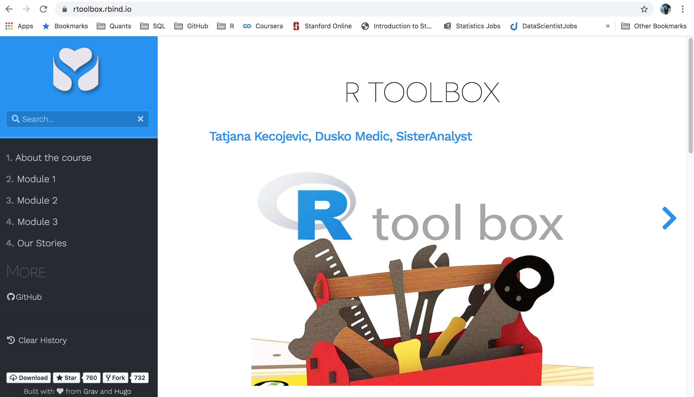

class: inverse, center, middle

## **WHY** did Cambridge Analytica abuse the use of data?
# Because they could. 


```{r, out.width = "300px", echo=FALSE}

```

---
class: inverse, center, middle

```{r, out.width = "200px", echo=FALSE}

```
### Are journalist suitably equiped to confront this issue? 

### Are they able to up-skill to challange the deceivers?

### R Toolbox -> understanding of the power of data

---
class: inverse, middle
### Now you can start to fix things.

### - Examine and contradict corrupted claims and narratives. 

### - Back up your stories with scientific substanciation. 

### - Turn speculation into hard fact with your own data investigations.

```{r, out.width = "500px", echo=FALSE}

```

---
class: inverse, middle

```{r, out.width = "350px", echo=FALSE}

```

### It's built with free, opensource tools and is reproducible and transparent

### Accessable and flexible, it allows for the inclusion of new technologies  

### The tool box is fully sustainable, it's built to last

---
class: inverse, middle

## Feasability 
```{r, out.width = "250px", echo=FALSE}

```

### - Setting up R Tool Box Web Platform

### - 80 days of training and mentoring of at least 20 journalist

### - Promotional and marketing activities using Google Ad Words and Facebook caimpaign.

### - Monitoring and evaluation 

---
class: center, inverse, middle

##Thanks!

[www.rtoolbox.rbind.io](http://rtoolbox.rbind.io//) 

Our presentation: <https://tanjakec.github.io/BML/BML2.html>

[www.sisteranalyst.org](https://sisteranalyst.org/) 

@sisteranalyst

@Tatjana_Kec

@duskomedic

```{r, out.width = "100px", echo=FALSE, fig.align = 'center'}

```
Slides created via `R` package [**xaringan**](https://github.com/yihui/xaringan).

The chakra comes from [remark.js](https://remarkjs.com), [**knitr**](http://yihui.name/knitr), and [R Markdown](https://rmarkdown.rstudio.com).

